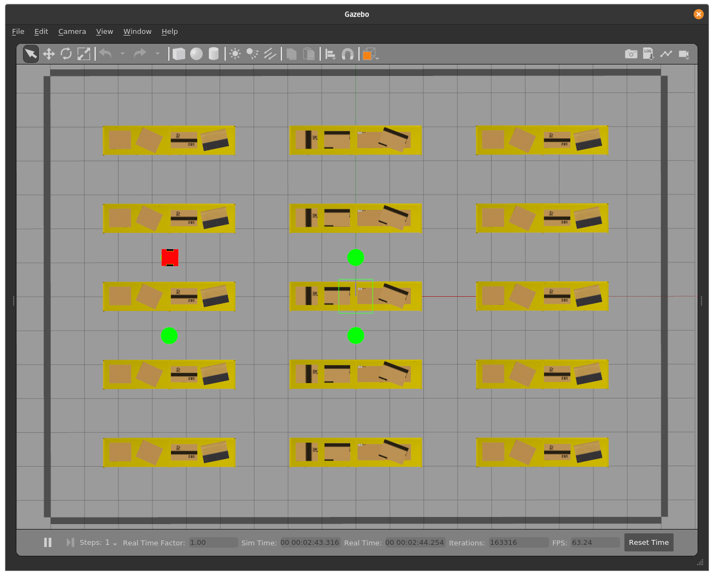
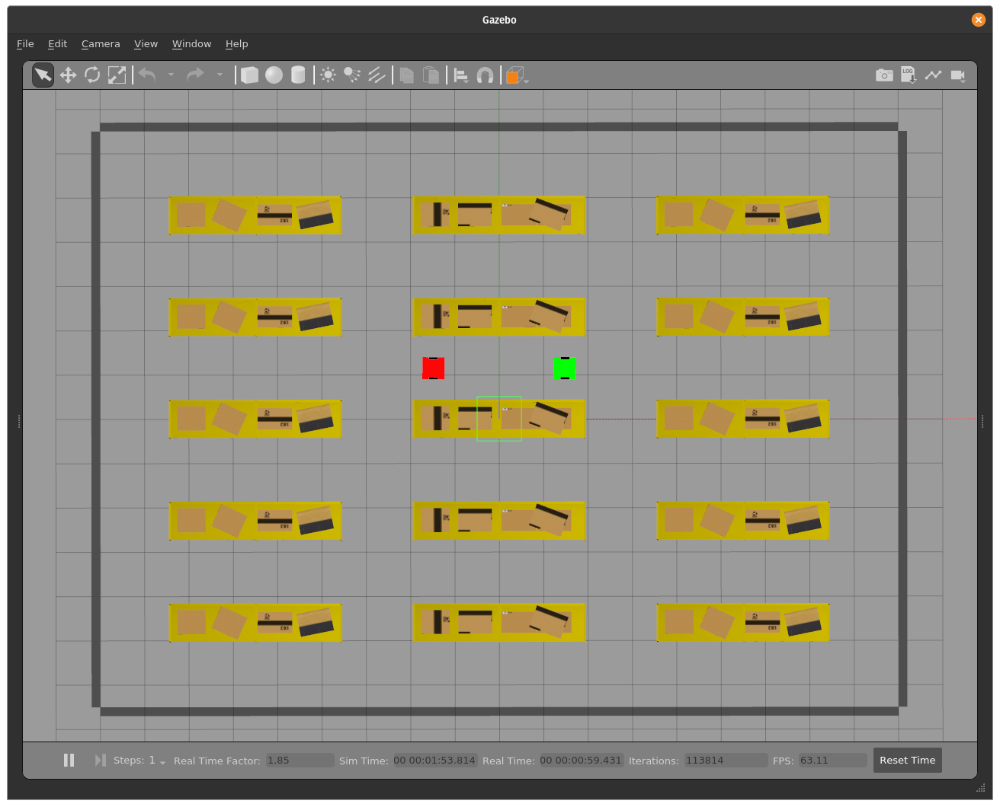
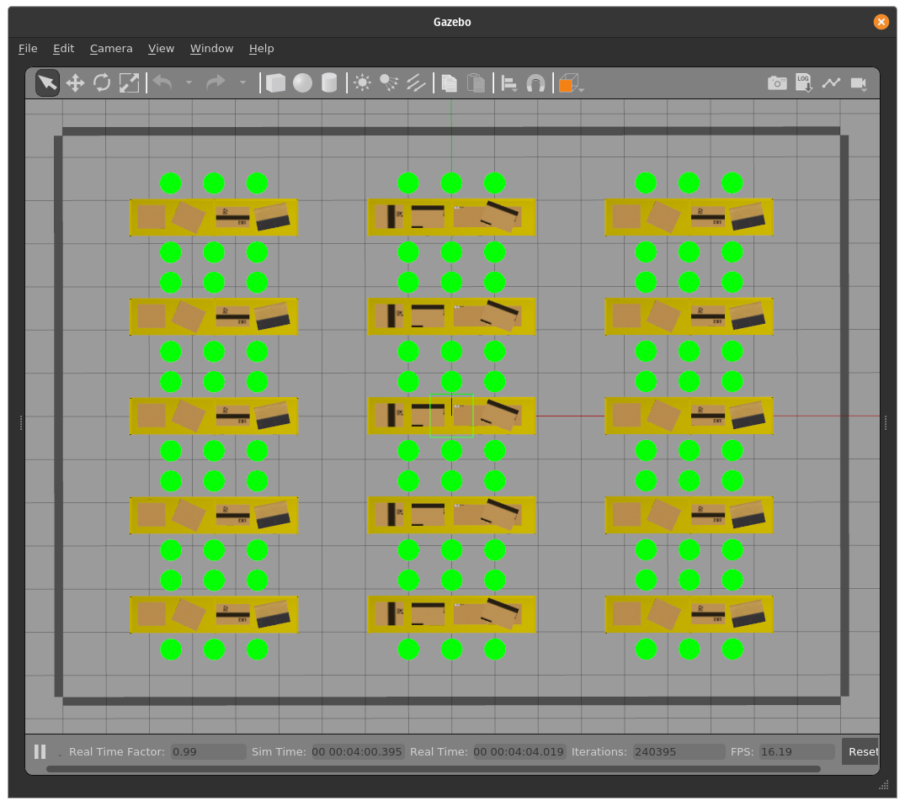
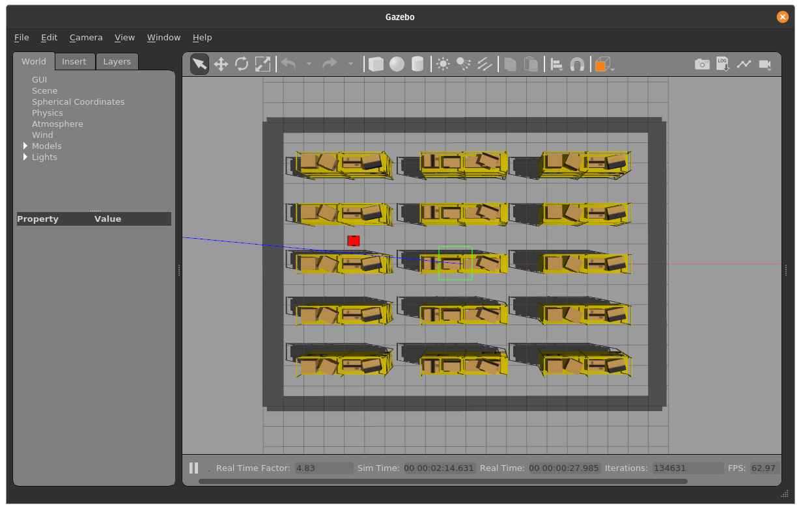
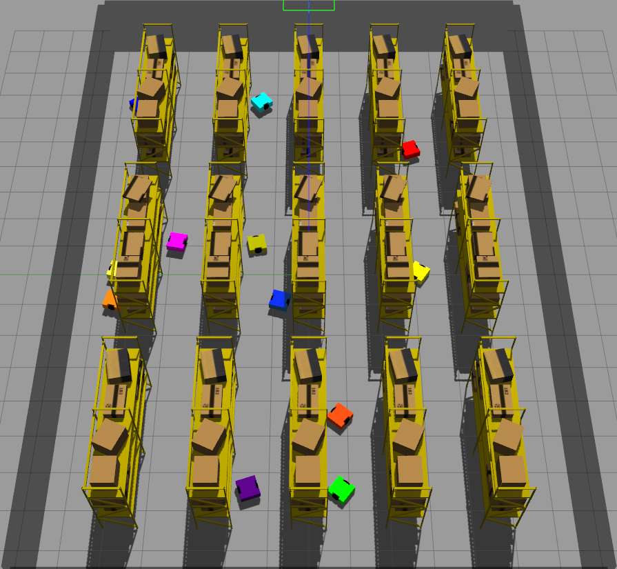
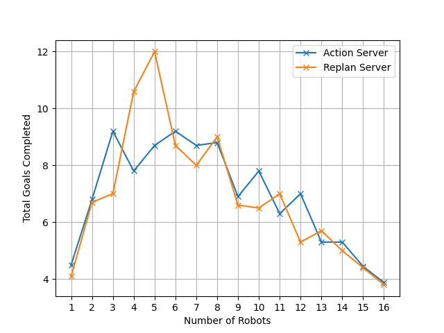
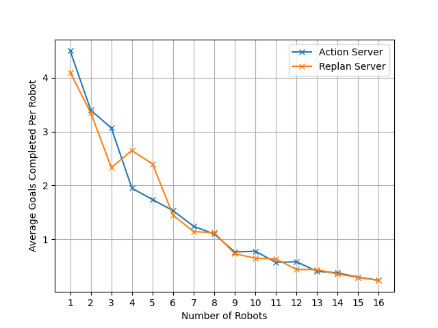
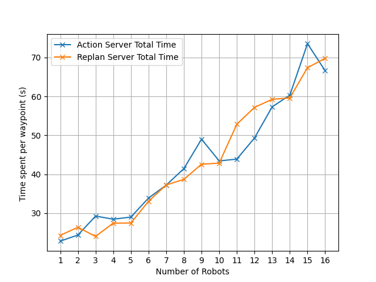

# Distributed Multi-Robot Trajectory Planning in a Factory Environment
Final Year Project for BEng Electronic and Information Engineering at Imperial College London. The thesis paper is [here].

## Folder Structure
- `src`
  - `multirobot_control`: Package containing source files, world files, and launch files. This will be where everything is launched from.
    - `multirobot_control`: Source files containing the implementation of all things coded in this project.
    - `launch`: Source files containing what is needed to launch a simulation run.
    - `params`: Files defining the different scenarios and the parameters for each of them.
    - `worlds`: Where the simulation worlds are defined. The simulation is built around `factory_world2`.
  - `planner_action_interfaces`: Custom ROS2 messages, services and actions defined for the purposes of this project
  - `robot_base`: URDFs source files for the robot.
- `doc`: Pictures required for the report.
- `evaluation`: Code to auto test the algorithms inside the simulation.
- `todo.md` is a changelog and left to show the progress of this project.

## Dependencies
- Gazebo 11
- ROS2 Galactic
- `pyyaml`

Do install these before attempting to run anything in this project.

## Setup
The pathing for this project is hard-coded to my machine. After cloning this repo, I recommend going through it with an editor like VS Code and searching for the string `/home/tianyilim/fyp/ic-fyp` and replacing it with whatever file path you have cloned this directory in.

Future instructions will assume the base directory of this repo to be `$WORKSPACE`.

To build the project, `cd $WORKSPACE` and run `colcon build`. This builds the project in the ROS build system.

In another terminal, `cd $WORKSPACE` and run `source install/setup.bash`, which associates the built files with the ROS launch system.

## Usage
### Demonstration
To view robots running around, run `ros2 launch multirobot_control spawn_bots.launch.py`. This will prompt you to choose one of three scenarios:
- Single robot scenario
  - 
- Robot swap scenario
  - 
- Randomized scenario.
The source files for each of them are located in `src/multirobot_control/params`. 
  - `scenario_random` is where several robots are spawned in random locations with random goals. To choose how many robots to spawn, you can edit this file. Remember to follow the structure of naming robots in order with name as `"robotN"` with N being an increasing integer. Maximum number of robots supported is 16.
  - Robots and goals will be in these locations 

By default the scenario will not auto-start. To start it automatically, run `ros2 launch multirobot_control spawn_bots.launch.py goal_creation:=true` to launch the goal assignment node alongside the rest of the simulation.

To visualize the simulation in the Gazebo GUI, add in `headless:=false` to the list of arguments.

The list of arguments is as follows:
- `params_file` : The path to the parameters file that sets the settings used by the DWA and RRT planners. Defaults to `$WORKSPACE/src/multirobot_control/params/planner_params.yaml`.
- `headless`: `true` to run without the Gazebo GUI, otherwise `false`. Defaults to `true`.
- `log_level`: Choose between `debug`, `info`, `warn`, `error`, based on the desired verbosity. Defaults to `info`.
- `rviz`: `true` to run with the RViz demonstration, `false` otherwise. Defaults to `true`.
- `goal_creation`: Whether or not to auto-start the `goal_creation` so the test scenario automatically starts. Defaults to `false`.

To change the parameters of the simulation, go into `$WORKSPACE/src/multirobot_control/params/planner_params.yaml`. 

There is also a `realtime_factor` parameter in each of the scenario files that is currently set to 1.0. If you wish to speed up the simulation, you can increase it. However, do edit `gazebo_params.yaml` as well. The `publish_rate` parameter should not be less than 50*`realtime_factor`.

### Evaluation
To test the robots, go into `$WORKSPACE/evaluation`. There are a few files to be configured:
- `config.py` sets the search space based on the parameters. The default is to change the planner type with respect to the number of robots in the simulation. Other scenarios can be tested as well.
- `create_test_scenarios.py` creates test scenarios based on the settings in `config.py`. 
  - The settings are set in `scenario_settings` and `param_settings` inside the file.
  - `scenario_settings` sets up the test scenario within the test world.
    - If desired to run random goals, leave `scenario_settings['goal_array']` to be an empty list `"[]"`. Else populate it with elements equal to exactly the number of robots in the simulation. An example is given in the comments, but another can be found in `$WORKSPACE/src/multirobot_control/params/scenario_swap.yaml`.
    - If desired to run random goals, specify the total number of goals and the watchdog timeout as well.
    - Provide a set of starting x, y, and theta values for each robot if desired to start them in defined positions. An example is in the comments.
  - `param_settings` sets up the default configuration of the robot.
    - This is similar to what is in `$WORKSPACE/src/multirobot_control/params/planner_params.yaml`.
- `visualise_results.py` runs through the results of the tests. However, you will need to modify it to display the relevant metrics you wish. It collates:
  1. Average number of goals completed per robot per run
  1. Total number of goals completed per run
  1. Average distance travelled per robot per run
  1. Average time spent planning per robot per run
  1. Average time spent moving per robot per run
- `evaluate_planners.bash` creates test scenarios by invoking `create_test_scenarios.py` and runs all of them.

- To automatically run tests, run `bash evaluate_planners.bash`. Depending on the test, this may take quite a while.

### Illustrations:
- Sim Environment:
  
- Robot Photos
  
  
- Many robots in a simulation
  

### Results:
- Total goals per run with increasing robots
  
- Average goals per robot per run with increasing robots
  
- Average time taken per waypoint per robot per run with increasing robots
  