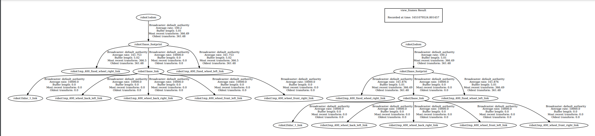
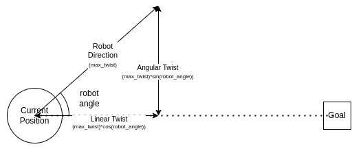

# Todo, Changelog, Roadmap for FYP

## Todo
- [x] Get the multiple robots spawned to be visualised with different colours in Gazebo (eg. Robot1 is red, 2 is blue, etc...)
- [x] Show a visualization in Gazebo(?) of each robot's goal position
- [x] `spawn_single_bot.py`/`individual_bot.launch.py` : Xacro is now parsed twice. Try to get the URDF to only be parsed once, preferably in `individual_bot.launch.py`
  - Parsed in `spawn_bots.launch.py`
- [x] Programatically create Rviz files for visualising each robot (currently hardcoded)
- [ ] Figure out how to add VCS to the `neo_simulation2` and `aws-robomaker-small-warehouse-world` folders in `src`

---
## Changelog
### Tue 19/04/22
- Create package

### Mon 25/04/22
- Import AWS warehouse world and Neobotix robot packages for simulation
- Add in `multirobot_control` package for overall control (sunset `robot_base` package)

### Tue 26/04/22
- Modfiy URDF for Neobotix MP-400 robot and add to the `multirobot_control` package. It still refers to the meshes in `neo_simulation2` (less redundancy)
- Add in spawn scripts for multiple robots with their own namespaces.

### Wed 27/04/22
- Managed to learn how to get 2 robots to work within their own tf2 namespaces:
  1. Use `xacro` to add a prefix to each of the frames of the robot. For instance, `base_link` becomes `robot1base_link`, etc.
  2. Use the `relay` Node from `topic_tools` to relay topic info from each robot's namespace to the  main `tf` and `tf_static` topics. This was launched in `individual_bot.launch.py`.
  3. Used `GroupAction` in `individual_bot.launch.py` in the hopes of getting Nodes to launch in sync.
  4. Cleaned up the TF tree, so now it looks like this.
  5. 
- Questions:
  - [ ] Robots behave poorly in the AWS warehouse environments but not the Neobotix workshops. Might try to figure out why, but probably better to just use the Neobotix workshop environment for now
  - [x] Is it bad if the wheel frames connect to `base_footprint` instead of `base_link`? Need to refer to reference `tf_tree`s from Neobotix or elsewhere.
    - This is the behaviour out-of-the-box from the Neobotix demo.

### Thu 28/04/22
- Created a new node, `GazeboOdomGroundTruth` in `gt_odom.py` that listens to the world pose of a given link and attempts to broadcast it (and its relavant tf transforms).
- This is a replacement for trying to call the `/get_entity_state` Gazebo ROS service, which somehow doesn't exist anymore. Hopefully this workaround helps the people in [this thread](https://github.com/ros-simulation/gazebo_ros_pkgs/issues/1287).
- Implement `localization.launch.py` which launches the map server and the lifecycle manager needed to get it running.

### Fri 29/04/22
- Added in `navigation.launch.py` which is supposed to bring up navigation, but so far has been quite a pain.

### Mon 02/05/22
- Create a new URDF file that is similar to the original Neobotix robot in dimension but without any funky physics
- Use a sample model world with 3 cylinders and attempt to implement a DWA node

### Tue 03/05/22
- Modernized original URDF in `robot_base` with what we learned from playing with the Neobotix robot. Now can have ground truth odometry by adding a (undocumented) feature from the `diff_drive` controller.
- Realised that the timestamps being published by `gt_odom.py` are wrong. Just echo back the transform timings by accessing the same header as the odometry transform.
- After all this, our command to run the experiment is: 
  ```bash
  ros2 launch multirobot_control spawn_bots.launch.py \
  world:="/home/tianyilim/fyp/ic-fyp/src/multirobot_control/worlds/test_world.world" \
  urdf:="/home/tianyilim/fyp/ic-fyp/src/robot_base/urdf/robot_base.xacro"
  ```

- [x] Fix Xacro errors for the `test_world` xacro file: perhaps xacro needs to use "urdf"-esque tags?
  - See solution on [Fri 13/05/22](#fri-130522) - essentially ran into a reserved keyword and there was not much of a warning

### Wed 04/05/22
- Create a custom action package in `planner_action_interfaces`, relying on `geometry_msgs`.
  - In addition to the tutorial on custom interfaces [here](https://roboticsbackend.com/ros2-create-custom-message/), we also need to remember to add dependencies to `rosidl` as per the forum post [here](https://answers.ros.org/question/326008/ros2-run-symbol-not-found-on-custom-msg/).
- Implemented a (naive) DWA local planner / controller. 
  - To run, minimally `launch` the simulation (as above) and then run `ros2 run multirobot_control dwa_server --ros-args -r odom:=robot1/odom -r cmd_vel:=robot1/cmd_vel` (the Action Server). 
  - Run `python3 ~/fyp/ic-fyp/src/multirobot_control/multirobot_control/dwa_client.py` (the Action Client) which can take in arbitrary x and y positions, which the DWA approach will then evaluate.
  - Alternatively, try `ros2 run multirobot_control dwa_client --ros-args -r /dwa/_action/feedback:=/robot1/dwa/_action/feedback -r /dwa/_action/status:=/robot1/dwa/_action/status`.
- [x] Implement tunable parameters as some sort of config file:
  - [x] Limits for linear and angular movement
  - [x] Safety thresholds for robot
  - [x] Forward simulation duration
- [ ] Implement parameterized map (perhaps by parsing the world file?)
- [x] Tune DWA parameters (`goal_K`, `safety_thresh_K`, `non_thresh_K`)
- [x] Add cost/benefit to orientation wrt goal
- [x] What happens when all DWA options are equally bad?
- [x] Check if simulated input using `cmd_vel` is sufficient
- [x] Namespaced nodes
- [x] CVA

### Thu 05/05/22
- Made a new message `OtherRobotLocations` in `planner_action_interfaces` for a central node to broadcast the (absolute) positions of each robot to other robots.
- Made a new node, `odom_distribution` which simulates communication distance between the set of robots.
- Run by `ros2 run multirobot_control odom_distribution --ros-args -p 'robot_list:=["robot1", "robot2", "robot3"]' -p pub_freq:=0.5`, can adjust `robot_list` as required for the number (and name) of robots in the simulation, and `pub_freq` as how often the terminal should be spammed; could be the same as the calculation frequency of the DWA planner.
- [x] `OtherRobotLocations` should contain a `geometry_msgs/Twist` in the World frame as well - so that each individual DWA planner can use that to plan their eventual paths.
  - Not implemented as a `Twist`, see eventual implementation on [Fri 13/05/22](#fri-130522)
- [ ] Create Gazebo plugin to control individual wheels, while also publishing the TF and odom transforms of the robot.

### Fri 06/05/22
- Try remapping namespaces on the command line with 
- `ros2 run multirobot_control dwa_server --ros-args -r __ns:=/robot1` 
- `ros2 run multirobot_control dwa_client --ros-args -r __ns:=/robot1`

- `odom_distribution` has some skeleton code for robots to broadcast where they will be in the future. Currently doesn't work because of topic problems.
- `dwa_server` sees the _future_ positions of other robts as a obstacle (subscribe to `OtherRobotLocations`)

### Mon 09/05/22
- Do **not** update Python and Apt packages often - spent a lot of time fixing some dependency with `gazebo_msgs` deciding to break, had to uninstall and reinstall `ros-galactic`.
- Added in programatically changing the colour of robots in Gazebo so they can be distinguished from one another.

### Tue 10/05/22
- Added in `goal_creation`, a node that spawns goals and visualises them in Gazebo.
- Similar to `odom_distribution` run `ros2 run multirobot_control goal_creation --ros-args -p 'robot_list:=["robot1", "robot2", "robot3"]'`

### Thur 12/05/22
- Refined `goal_creation` node, using a timer callback to check if robots are ready for their next goal. This prevents nested callbacks and allows the simulation to run smoothly.
- [x] Robots to move to their original posiitons (guaranteed collision-free) after finishing goals to ensure goals do not end with colliding robots.
  - This is implemented as a parameter. Perhaps it can also be set in the launch file, eventually. But for now, we run 
  - `ros2 run multirobot_control goal_creation --ros-args -p 'robot_list:=["robot1", "robot2", "robot3"]' -p 'robot_starting_x:=[0.0, 0.0, 0.0]' -p 'robot_starting_y:=[2.2, 0.0, 4.5]'`
- [x] Use the params file with the DWA server as well as the `odom_distribution` nodes, and in the future the `goal_creation` node as well.
- [x] Use the params file as the source of truth for robot spawning also (using PyYaml)
- Now we can perhaps run `ros2 run multirobot_control goal_creation --ros-args --params-file "/home/tianyilim/fyp/ic-fyp/src/multirobot_control/params/planner_params.yaml"`

### Fri 13/05/22
- Use `PointStamped` instead of `Point` for robots to publish their planned positions through `dwa_server`. To this effect, added a `DWAServerStatus` `Enum` to `dwa_server`. If there is a current goal being moved towards, we publish the planned position. If there is no current goal, we publish the current position. `PointStamped` allows us to send the namespace (and thus name) of each robot, allowing for centralised association.
- Fixed xacro not working on world files. It turns out that somewhere, `cylinder` is a reserved keyword or something. Therefore, renamed the macro we used to be `cylinder_element`.
- Added `factory_world.world` in `worlds`. Remember to regenerate the xacro file whenever it is updated. 
- [x] Further tune DWA node parameters, they do poorly when trying to rotate the robot on the spot.
- [x] Scale up single robot DWA demo to the "warehouse" environment
  - [x] Simplify environment to look like Amazon warehouse (manhattan-like)
    - If global planner is needed perhaps use RRT.

### Mon 16/05/22
- Put in shelf model from AWS warehouse repo into the `models` folder. Need to add `{repo-path}/src/multirobot_control/models` to the `GAZEBO_MODEL_PATH`, which should be handled in the `spawn_bots.launch.py` launch file.
- Fixed a bug in AWS shelves SDF files. Previously in their collision/geometry add tags, their `uri` was set to be `file://models/...` when it should be `model://...`. This meant that Gazebo could not find the DAE files.
- All files read from `params/planner_params.yaml` to decide how many robots to spawn.
- Added in collision detection with Axis-Aligned Bounding Boxes to model the shelves, as they are always aligned to the _x_ and _y_ axes of the world. The robot is modelled as a circle (as it is roughly one.) This algorithm is implemented in `dwa_server.py -> dist_to_aabb`.
- Added in `map_params`, a place to keep the AABB representation of the shelves and walls.
- However, the DWA node is insufficient to reach the goal by itself. The robot is unable to find a path around the rectangular boxes and settles to a local minima.
- [x] To fix: if robots are unable to find _any_ good trajectories, then they continue with their past trajectory, which often means they actually hit something.

### Tue 17/05/22
- Fixed a bug in the AABB distance finding code.
- Added in a heading weight to the code which allows the robots to orient themselves to face approximately the next goal (~+-70deg, specified in params->`angular_thresh`). However, it still fails if we use the rectangular obstacles as in our sample world.
- Solution:
  - [x] Implement RRT* to obtain waypoints for each robot.
- [x] Visualizations in RViz need to be figured out.
  - [x] Visualise obstacles from `OBSTACLE_LIST` in RViz using a new node, `map_visualisation.py`. This uses `Marker` messages in RViz to more cleanly display the static obstacles.
  - [x] Visualise goals from `goal_creation`
  - [x] Visualise sample trajectories from `dwa_server`
  - [x] Visualise waypoints from RRT node

### Wed 18/05/22
- Added in arrow visualisation for the robot, now it is easier to see what trajectory the DWA controller chooses.
- Reinstated reversing for the controller. This now lets the robot get out of sticky situations where it would otherwise previously be stuck.
- Started implementation of a RRT* global planner to get robots around the obstacles
- Perhaps rename `planner_action_interfaces.action.LocalPlanner` to something like `MotionPlanRequest` as these messages are useful for both Global and Local cases.

### Thu 19/05/22
- Added in implementation for a RRT* global planner in `rrt_server`. This takes in parameters from `planner_params`.
- Core implementation of the RRT* planner is in `rrt_node`, which is then called by `rrt_server`.
- `rrt_server` internally calls `dwa_server` to get from point to point.
- As we now have 2 path planners (global and local), we rename `dwa_client` to `plan_client` and specify the path planner as an argument.
- For instance, to run `robot1`:
- `ros2 run multirobot_control plan_client --ros-args --params-file src/multirobot_control/params/planner_params.yaml -r __ns:='/robot1' -p planner:='rrt_star'`
- `ros2 run multirobot_control plan_client --ros-args --params-file src/multirobot_control/params/planner_params.yaml -r __ns:='/robot1' -p planner:='dwa'`

### Fri 20/05/22
- [x] Fix bug where RRT is not terminating when calling `goal_creation`
  - This was due to the line intersection being too strict when checking for waypoints to the goal.
  - Adding a flag to `rrt_node->RRT.check_line_intersection` to relax the inflation values for connecting a waypoint to the goal state helped.
  - Also, we increase the `max_extend_length` to improve the exploration characterstics of RRT.
- [x] Bug where we have "`Error raised in execute callback: [rrt_chooose_parent] parent node must not be None!`"... perhaps after adding feature when parent of goal node is overwritten?
  - Because we did not update the cost of the goal node itself, therefore it will never be lower than `np.inf`

### Tue 24/05/22
- [x] RRT planner will not work if the _start_ position is invalid (always getting collisions with any proposed node)
  - Snap RRT planner start/end positions to the nearest point on the relavant obstacle/AABB
- [x] Don't perform snapping to AABB for goal positions? Or perhaps make the threshold for inflation smaller (remove safety radius?)
- [x] Robot somehow skips goals when going through local planner waypoints. Look through the state machine of `rrt_server`
  - Write local planner status in the same function (not as part of another callback)
- RRT planner now chooses waypoints with a safety radius for intermediate waypoints, but not for the start and goal waypoints.
- RRT planner now returns a tuple of path (list), #nodes (for debugging purposes)
- RRT `check_line_intersection` also returns the closest intersection point to one of the lines. However, adding these close intersections to the node list did not help getting solutions to converge.
- Expose P gains for angular and linear error for DWA as parameters
- When getting the closest point to an AABB from `dist_to_aabb`, we add a small amount (0.01) to the width and height of the box so that we can pass `>` and `<` comparisons written elsewhere (and so RRT doesn't stall)
- Got DWA implementation not to use `sleep`, using a while loop instead. Not ideal as it busy waits. Is there a way to write the action to run on a timer interrupt of sorts?
- Added a virtual point before each goal point that results in a 90 degree turn towards the goal, hopefully allowing the goal to be reached at a 90 degree orientation to the shelf.

### Wed 25/05/22
- [x] Getting DWA to track the waypoints more robustly and with better directionality
  - [x] TODO final goal needs tweaking, when robot goes back to its original position
- [x] Tuning DWA for slightly better robustness
- Tweaks to DWA:
  - Changed the heuristic to score yaw. Instead of adding a bonus proportional to the distance score that is scored as an inverse, we use a simple linear function, where the cost of angular error is a proportion of the distance score, the maximum cost docked from the distance score is `angular_K`.
  - Also cap the distance error between `orientation_lb_deg` and `orientation_ub_deg`.
  - Tweak the `safety_thresh` for RRT to generate more "legit" waypoints (not cutting through corners unrealistlcally, for example)
  - Add to `simulate_duration` to ensure the robot can "look ahead" further
- [x] Debug `odom_distribution`, doesn't seem to work anymore
  - The `dist_thresh` param name clashed with the `odom_distribution` one, renaming it seems to have fixed the problem.

### Thu 26/05/22
- QOL/Presentation tweaks:
  - [x] Breadcrumbs disappear when they are approached
  - [x] Colours for diff robots (and their respective goals) in RViz
  - [x] Goal rejected by robots when re-running `goal_creation` multiple times
    - Randomly generate the first 15 UUID integers, because somehow the action server can't repeat UUIDs.
- [x] Come up with metrics on how delivery time / package throughput is affected by number of robots
  - This is dumped as a YAML file that can be parsed later.
    - [x] start time
    - [x] end time
    - [x] each robot has its own entry with a list corresponding to each goal:
      - [x] start coords
      - [x] distance travelled
      - [x] number of rrt waypoints
        - To complete the first 3 we need to modify the response from each action.
        - Luckily this does not break the pre-existing API, `LocalPlanner` still works for the DWA node.
      - [x] goal coords
      - [x] start time
      - [x] completion time
    - [x] parameters
      - The _easiest_ way to do this is to pass in the file path as another parameter/launch argument in `goal_creation`.
      - Thus, now run `ros2 run multirobot_control goal_creation --ros-args --params-file "/home/tianyilim/fyp/ic-fyp/src/multirobot_control/params/planner_params.yaml" -p params_filepath:="/home/tianyilim/fyp/ic-fyp/src/multirobot_control/params/planner_params.yaml"`
- Added a piecewise function to score distance away from goal. If less than 1.0m away from the obstacle, use an inverse function, but from 1.0 to 1.5m (and beyond) we use a linear function. 
- [x] Setting DWA distance threshold parameter based on waypoint or goal.
  - Add 2 distance thresholds, `dist_thresh_hi` and `dist_thresh_lo` that correspond to waypoints OTW to the goal, or the goal itself.
  - [x] Debug this, calling in callback sometimes causes stuff to hang. Either write as async or something else.

### Fri 27/05/22
- [x] Recovery behaviour
  - [x] Implement a stall detection algo (integrate the distance travelled in the past ~seconds/iterations?)
    - The DWA planner now takes in 2 more parameters: `stall_det_period`, which governs the time window in which to check cumulative distance travelled, and `stall_dist_thresh`, which is the upper bound of distance travelled for a stall to be considered.
    - When a stall is detected, there are two options depending on if we are (too) close to an obstacle.
      - If too close to an obstacle, a 'virtual' goal is created that gets the robot away from the obstacle (using a point on AABB)
      - If not, we set the goal to the current waypoint, as per usual.
    - Using `cmd_vel` as an interface we select the angular and linear twists, as shown in this diagram:
    
  - [ ] Robots get stuck in local minima when far away from a goal but close to obstacle. Perhaps setting costs to be % of the `goal_plus` would help?
    - This is minimised using the stall detection algorithm mentioned above.

### Sat 28/05/22
- QOL change: Set RViz programatically based on the number of robots in the simulation.
- [x] Performance issues with multiple robots running on the same computer, check if there is any 'sim time' setting instead of using wall clock time, if `time.sleep` affects anything?
  - Add in `use_sim_time=true` for all nodes, hopefully fixing timing issues as number of robots scale.
  - Use `create_rate` in the RRT and DWA nodes to create `Rate` objects that handle sleeping actions in ROS time (instead of relying on `time.sleep`)
- DWA stall detection now also considers moving away from other robots (in addition to away from obstacles)
- [x] Come up with test environments
  - Decoupled node parameters from the test environment parameters. `params/planner_params.yaml` now only has the parameters concerning operational nodes (eg. DWA settings).
  - To set up a test environment, write a `scenario_*.yaml` and place into `params/`. Then to choose a scenario, do **two** things:
    1. Set `scenario_file_dir` in `spawn_bots.launch.py` to the appropriate file
    2. When running `goal_creation` also specify the same file: eg.
      - `ros2 run multirobot_control goal_creation --ros-args --params-file "/home/tianyilim/fyp/ic-fyp/src/multirobot_control/params/scenario_swap.yaml"`
  - For now we have two scenarios, `scenario_random` and `scenario_swap`. See those for examples on how to create a randomised / deterministic set of waypoints for each robot.
  - Some other ideas for test scenarios:
    - [x] Swap position (perhaps on the same x-coordinate/axis)
    - [ ] Hold position (one robot has reached its goal but another robot needs to pass through its current position)
    - [ ] Standardised goal sets for different robots
    - [x] Parameterised interface for choosing test environments
  - Some QOL things would be an ability to select the test environments in programatically, perhaps using a `click` interface like with the Formula Student launch file.

### Mon 30/05/22
- Modified robot URDF to get wheels to fit within the robot base instead of jutting out.
- Also reduced total robot chassis weight from 10kg to 4kg (what kind of 50x50cm robot is 10kg?!)
- Dynamic replanning/reassignment for RRT waypoints -> Pre-req for more complex (and unpredictable) DWA movements
  - [x] Line of Sight check to current waypoint
  - [x] Ability to cancel DWA action
  - [x] Check for line of sight to the current waypoint. If that is lost, abort and replan
  - [x] Check if there are other waypoints that are within line of sight (and within a certain radius). If so, skip preceeding waypoints to get to that one.
- Also removed `spin_callback` in RRT server, using sleep directly in the main `execute_callback` node instead. Not sure if that helps or harms the performance...
- Ideas for joint DWA metrics and implementation:
  - Sum(?) of scores for distance to goal - don't care about orientation for now, cos we are more concerned about getting past each other
  - Orientation of robot towards each other (don't want robots to be on a colliding trajectory)
  - In addition to the regular DWA metrics:
    - Distance to each other and obstacles (required to avoid collision)
  - Cap the joint DWA speed and remove the safety radius so that robots are more able to maneuver around the tight spaces.
- This form of joint DWA will only work so long two robots can pass through
- Implement status / metric checking services on DWA and RRT servers:
  - [x] `get_dwa_server_status`
    - Also shifted all action server status tracking to `planner_status.py`; this should have the same ordering as `GetPlannerStatus.srv`
  - [x] `get_num_remaining_waypoints`
    - Created a new service type called `GetIntValue.srv`, returns an Int32 value with no need for a request.
  - [x] `get_total_manhattan_dist`

### Tue 31/05/22
- [x] Revert back to `spin_callback` in RRT server as using sleep directly in `execute_callback` leads to poor performance.
- [x] Make a **new node** for this variant of DWA, selectable from the launchfile.
  - This node is called `dwa_multirobot` and its action is called `dwa_multirobot`. 
- [x] Create function for robot priority selection (must be deterministic, no handshaking)
- [x] Query DWA server status in RRT planner instead of handling "manually" in code
  - This is published with the `planner_action_interfaces.msg.PlannerStatus` msg type on the `dwa_status` topic whenever a state change occurs.
  - [x] Change the original DWA server to follow this model
  - [ ] Check if DWA server is `PlannerStatus.PLANNER_READY` before starting to give any commands. Currently calling service to check the status never returns
- [x] New states for `deferred` and `exec_joint` in `planner_status.py` and `GetPlannerStatus.srv`
- [x] Create `GetWaypoints.srv` service that returns a `Point` array (with waypoints), `waypoint_idx`, and Manhattan distance remaining.
- [ ] Goal arbitration in DWA server
- [ ] Change the DWA server to a structure similar to the RRT server: `execute_callback` polls for state to change back to `PlannerStatus.PLANNER_READY` before returning. Furthermore, if the node goes from `PLANNER_READY -> PLANNER_DEFERRED -> PLANNER_EXEC`, it will still be able to reach its original goal.
- [ ] RRT server not to `pop` off stuff from the waypoint array but to use `waypoint_idx` instead so that the joint DWA planner will always have a waypoint within line of sight
- [ ] Service to update RRT server with result of goal arbitration in DWA server
- [ ] Think about the required machinery for the RRT server to handle changes in the DWA state machine

---

- [ ] Set up multi robot joint planner
  - [ ] Each robot will run DWA by itself, unless they are in close proximity. Then they could perhaps check if they were in danger of colliding.
  - [ ] if 2 robots are in danger of colliding then we must use a 2-robot planner that searches the 9x9 space of possibilities of each robot
  - [ ] There is a real chance that more than 2 robots come in proxmity
- [ ] Script to parse the YAML log files and show a visualisation (perhaps can do this semi-manually in Excel for a small-scale project...)
- [ ] Something to set heading goals, so robots face the goal with some certainty
- [ ] Think about how to get both implementations of `dwa_server` to inherit from the same class so there is less repetition?
- [ ] Tips on report, what should be done in terms of references, report structure etc?